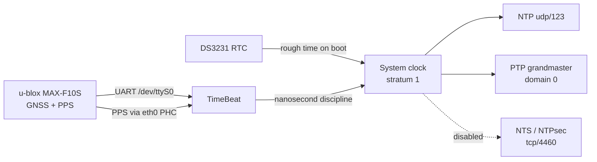

# timecard-mini-lite

Ansible playbook to configure a Raspberry Pi CM4 + [TimeBeat Mini HAT Essential](https://www.timebeat.app) as a stratum-1 NTP/PTP/NTS timeserver. Runs against a freshly-flashed Raspberry Pi OS Lite (64-bit, Bookworm), replacing the full TimeBeat desktop image with a lightweight, reproducible, config-as-code setup.

---

## Background

I have wanted to experiment with timing servers for a while, and recently found the time to build one for my home network. With a bunch of parts already to hand, the addition of a [TimeBeat Timecard Mini Essential](https://store.timebeat.app/products/open-timecard-mini-essential) board, designed for the Raspberry Pi CM form factor, was enough to put together a neat little stratum-1 server. After trying out their [example CM4 image](https://www.timebeat.app/downloads) and [guides](https://community.timebeat.app/timecard-mini-ecosystem-guides-1ah27h7i), I wanted something more lightweight, reproducible, and hackable.

This repo is the result: an Infrastructure as Code Ansible playbook that builds the server from a plain Raspberry Pi OS Lite image. Alongside the core setup it includes tooling for experimenting with GNSS data and timing protocols, and I used the project as an opportunity to explore several technologies, including using Claude Code and Gemini as AI pair-programmers throughout. I also designed and 3D printed cases to make the installation a bit neater. This is very much a starting point rather than a finished project, and I intend to continue exploring GNSS data, timing accuracy, and precision time protocols.

---

## Architecture



- **TimeBeat** disciplines the system clock from GPS/PPS, serves NTP directly, and serves PTP (IEEE 1588) to the network
- **DS3231 RTC** sets a rough system time on boot via the kernel `i2c-rtc` driver, allowing the clock to be sane before GNSS lock
- **NTPsec** is installed and configured but currently disabled — TimeBeat's built-in NTP server is used instead. NTPsec (with NTS) is worth revisiting once timing accuracy has been investigated further.

---

## Hardware

| Component | Details |
| --- | --- |
| Compute module | Raspberry Pi CM4 |
| HAT | TimeBeat Open Timecard Mini HAT Essential (GNSS u-blox MAX-F10S (UART on `/dev/ttyS0`, also I2C bus 1 addr 0x42)) |
| Carrier board | Waveshare CM4-IO-BASE-A |
| Storage | NVMe SSD via PCIe |
| RTC | DS3231 connected to Standard 40-Pin GPIO Header |

> [!Note]
> Project was largely made of parts that I already had so slightly ecletic in nature. I also took some time to design and 3d print some cases for neater installation

### DS3231 RTC wiring

| DS3231 Pin | [Pi 40-pin header](https://pinout.xyz/) | BCM GPIO | Description |
| --- | --- | --- | --- |
| VCC | Pin 1 | — | 3.3V power |
| GND | Pin 6 | — | Ground |
| SDA | Pin 3 | GPIO 2 | I²C data |
| SCL | Pin 5 | GPIO 3 | I²C clock |

---

## Prerequisites

### Software (on your laptop/control machine)

- [Ansible](https://docs.ansible.com/ansible/latest/installation_guide/index.html) ≥ 2.17
- [1Password CLI (`op`)](https://developer.1password.com/docs/cli/get-started/) — for secret injection
- `make`

Install Ansible collections:

```bash
make deps
```

### 1Password vault setup

Create an item in 1Password with the following structure:

| Vault | Item | Field | Value |
| --- | --- | --- | --- |
| System Credentials | Timeserver | `password` | Admin user password (set during Pi Imager flash) |
| System Credentials | Timeserver | `ssh-public-key` | Your SSH public key (`cat ~/.ssh/id_ed25519.pub`) |
| System Credentials | Timeserver | `hostname-fqdn` | e.g. `timeserver.example.com` |
| System Credentials | Timeserver | `hostname-short` | e.g. `timeserver` |
| System Credentials | Timeserver | `gandi-livedns-token` | Gandi Personal Access Token (DNS scope, domain-restricted) |
| System Credentials | Timeserver | `license` | TimeBeat license file contents |
| System Credentials | Timeserver | `ntp-allowed-network` | Network address allowed to query NTP (e.g. `192.168.1.0`) |
| System Credentials | Timeserver | `ntp-allowed-netmask` | Netmask for NTP access control (e.g. `255.255.255.0`) |
| System Credentials | Timeserver | `timebeat-cli-password` | TimeBeat local CLI password (localhost only) |

The Gandi token should be scoped to **DNS permissions only** for the specific domain — see [Gandi PAT documentation](https://docs.gandi.net/en/domain_names/advanced_users/api.html).

### DNS prerequisite

The FQDN (e.g. `timeserver.example.com`) **must resolve** to the device's IP before the first deploy — the TLS role uses DNS-01 challenge to issue the Let's Encrypt certificate.

Add an A record via your DNS provider:

```config
timeserver    A    <device IP>
```

---

## Flashing the base image

Use **Raspberry Pi Imager** to flash **Raspberry Pi OS Lite (64-bit, Bookworm)** to the NVMe SSD.

In the Imager customisation settings (click the gear icon):

| Setting | Value |
| --- | --- |
| Hostname | `timeserver` (or your chosen short hostname) |
| Username | `admin` |
| Password | (the password you stored in 1Password) |
| Locale | GB / UTC |
| SSH | Enable — **Allow password authentication** |
| Wi-Fi | Leave blank (Ethernet only) |

---

## First run

```bash
cp inventory.yml.example inventory.yml  # set ansible_host to the device IP
make deploy-bootstrap                   # connects with password, deploys SSH key
```

Subsequent deploys use `make deploy` (SSH key auth). Always run `make check` first to review the diff before applying.

---

## Makefile targets

| Target | Description |
| --- | --- |
| `make deploy` | Normal idempotent run (SSH key auth) |
| `make deploy-bootstrap` | First-run using password auth (`admin` user) |
| `make check` | Dry-run with diff — no changes made |
| `make deps` | Install Ansible collections |
| `make lint` | Run ansible-lint |
| `make clean` | Remove generated vault.yml and fact cache |

---

## Services

**NTP** — TimeBeat serves NTP directly on `udp/123`. All variables are in `group_vars/timeservers/vars.yml`.

**NTS** — NTPsec is configured to serve NTS on `tcp/4460` but is currently disabled (`ntpsec_enabled: false`). When re-enabled, clients connect using the FQDN against the Let's Encrypt certificate:

```config
server timeserver.example.com nts iburst
```

**PTP** — TimeBeat serves PTPv2 multicast as grandmaster on domain 0. Clients on the same L2 segment receive Sync/Announce/Follow_Up messages every second.

**TLS** — Certificates are issued by Let's Encrypt via DNS-01 challenge using the Gandi LiveDNS API (no port 80 required). Auto-renewed by cron at 00:00 and 12:00 daily; renewal hook copies certs to NTPsec at `/etc/ntpsec/ssl/`.

---

## Firewall

| Port | Protocol | Service |
| --- | --- | --- |
| 22 | TCP | SSH |
| 123 | UDP | NTP |
| 319 | UDP | PTP event messages |
| 320 | UDP | PTP general messages |
| 4460 | TCP | NTS key exchange |

Default policy: deny inbound, allow outbound.

---

## Verification

After deployment, run these on the device to confirm everything is working:

```bash
# TimeBeat GPS/PPS lock — look for nanosecond offsets on pps lines
sudo journalctl -u timebeat --no-pager -n 50

# PTP multicast traffic on eth0
sudo tcpdump -i eth0 udp port 319 or port 320 -c 5 --immediate-mode

# GNSS position monitoring service
gnsstrack status

# I2C GNSS module (expect address 0x42 on bus 1)
sudo i2cdetect -y 1
```

---

## Troubleshooting

**TimeBeat not starting** — run in the foreground to see errors directly:

```bash
sudo /usr/share/timebeat/bin/timebeat \
  -c /etc/timebeat/timebeat.yml \
  -path.home /usr/share/timebeat \
  -path.config /etc/timebeat \
  -path.data /var/lib/timebeat \
  -path.logs /var/log/timebeat \
  -e
```

**GNSS not locking** — allow 5–15 minutes for cold acquisition. Check `journalctl -u timebeat` for lock status.

**PPS not working** — verify eth0 supports hardware timestamping: `ethtool -T eth0`. TimeBeat uses NIC hardware timestamping for PPS, not GPIO.

**Certificate issuance failing** — confirm the DNS A record is live (`dig timeserver.example.com`), the Gandi token has DNS write permissions, and the domain matches what's in 1Password.

**SSH lockout** — connect a keyboard/monitor, log in at console. The `admin` user has sudo access. Check `/etc/ssh/sshd_config`.

**NetworkManager profile conflict** — if a "Wired connection 1" profile exists from Pi Imager, check with `nmcli con show` and delete the old profile if needed.

---

## Licence

MIT — see [LICENSE](LICENSE)
